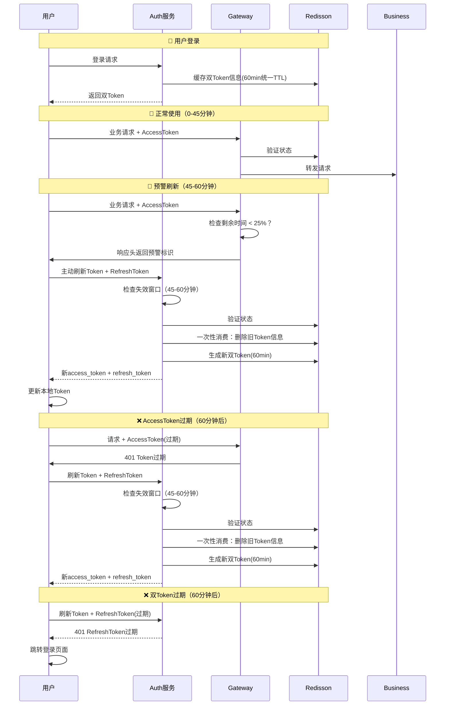

# 安全便捷的RefreshToken方案设计

## 🎯 **方案概述**

本方案在安全性和便捷性之间找到最佳平衡点，实现了一次性消费RefreshToken机制，配合失效窗口校验，既保证了用户体验又控制了安全风险。

### **核心设计理念**
- ✅ **便捷性优先**：用户在操作时间内无感知续期
- ✅ **安全性点缀**：通过失效窗口和一次性消费控制风险
- ✅ **实现简单**：避免复杂的设备绑定和IP限制

## 📋 **Token配置参数**

```java
// Token有效期配置
ACCESS_TOKEN_EXPIRE = 60;                    // 60分钟
REFRESH_TOKEN_EXPIRE = 60;                   // 60分钟（与AccessToken相同，一次性消费）
REFRESH_THRESHOLD = 0.75;                    // 3/4阈值提前刷新
REFRESH_WINDOW_THRESHOLD = 0.75;             // 45分钟刷新窗口
```

**设计变更说明**：
- ✅ **统一TTL**: AccessToken和RefreshToken都使用60分钟TTL
- ✅ **一次性消费**: RefreshToken使用后立即销毁，不复用
- ✅ **统一存储**: Redis中只存储一个对象，统一TTL管理

## 🔄 **完整的Token生命周期**



## 🎯 **核心机制详解**

### **1. 失效窗口校验机制**

```java
/**
 * 检查是否在刷新窗口内（45-60分钟）
 */
private boolean isInRefreshWindow(Long issuedAt) {
    long currentTime = System.currentTimeMillis();
    long tokenAge = currentTime - issuedAt;
    long totalLifetime = CacheConstants.ACCESS_TOKEN_EXPIRE * 60 * 1000L; // 60分钟
    
    // 45分钟后才能刷新，60分钟前必须刷新
    long minRefreshTime = totalLifetime * CacheConstants.REFRESH_WINDOW_THRESHOLD; // 45分钟
    
    return tokenAge >= minRefreshTime && tokenAge < totalLifetime;
}
```

**窗口逻辑：**
- ❌ **0-45分钟**：RefreshToken不能使用（过早）
- ✅ **45-60分钟**：RefreshToken可以使用（正常窗口）
- ❌ **60分钟后**：双Token已过期，需要重新登录

### **2. 一次性消费机制**

```java
@PostMapping("/refresh")
public Map<String, Object> refreshToken(String refreshToken) {
    // 1. JWT验证
    Claims claims = JwtUtils.parseToken(refreshToken);
    
    // 2. 失效窗口校验
    if (!isInRefreshWindow(claims.getIssuedAt().getTime())) {
        throw new BadCredentialsException("RefreshToken不在刷新时间窗口内");
    }
    
    // 3. Redis状态验证
    RBucket<Map<String, Object>> bucket = redisson.getBucket(redisKey);
    if (!bucket.isExists()) {
        throw new BadCredentialsException("RefreshToken已过期或已被使用");
    }
    
    // 4. 生成新Token
    Map<String, Object> newTokens = createNewTokens(userId, username);
    
    // 5. 一次性消费：立即删除旧RefreshToken
    bucket.delete(); // 关键：用后即焚
    
    return newTokens;
}
```

### **3. Gateway预警机制**

```java
// Gateway中的token过期预警（3/4 TTL）
private boolean shouldAddTokenExpirationWarning(Map<String, Object> loginUser) {
    long currentTime = System.currentTimeMillis();
    Long createTime = (Long) loginUser.get("createTime");
    long tokenAge = currentTime - createTime;
    long totalLifetime = CacheConstants.EXPIRATION * 60 * 1000L; // 60分钟
    long remainingTime = totalLifetime - tokenAge;
    
    // 剩余时间小于25%时预警（45分钟时）
    long warningThreshold = (long) (totalLifetime * (1.0 - CacheConstants.REFRESH_THRESHOLD));
    return remainingTime <= warningThreshold && remainingTime > 0;
}

private void addTokenExpirationWarningIfNeeded(Map<String, Object> loginUser, ServerHttpResponse response) {
    if (shouldAddTokenExpirationWarning(loginUser)) {
        response.getHeaders().add("X-Token-Warning", "expiring-soon");
        response.getHeaders().add("X-Token-Remaining", String.valueOf(remainingTime / 1000));
    }
}
```

## 🎯 **用户体验设计**

### **场景一：持续操作用户**
```
用户登录 → 正常操作45分钟 → 自动刷新Token → 继续操作 → 无感知体验
```

### **场景二：间歇操作用户**
```
用户登录 → 操作30分钟 → 离开35分钟 → 返回继续操作 → Token已过期 → RefreshToken刷新 → 继续操作
```

### **场景三：长时间离开用户**
```
用户登录 → 操作30分钟 → 离开1小时 → 返回操作 → 双Token过期 → 重新登录
```

## 🛡️ **安全风险分析**

### **风险点识别**

| 风险类型 | 风险描述 | 防护措施 | 风险等级 |
|----------|----------|----------|----------|
| **RefreshToken泄漏** | 攻击者获取RefreshToken | 失效窗口限制 | 🟡 中等 |
| **重放攻击** | 重复使用RefreshToken | 一次性消费 | 🟢 低 |
| **时间窗口攻击** | 在窗口期内滥用 | 45分钟窗口限制 | 🟡 中等 |
| **Token伪造** | 伪造JWT | HS512签名验证 | 🟢 低 |

### **风险评估**

#### **RefreshToken泄漏的影响**
```
攻击者获取RefreshToken → 只能在45-60分钟窗口内使用 → 使用后立即失效 → 风险窗口仅15分钟
```

**对比分析：**
- ❌ **主流方案**：7天有效期，7天风险窗口
- ✅ **本方案**：60分钟有效期，15分钟风险窗口

#### **安全优势**
1. **时间限制**：RefreshToken只能在特定时间窗口使用
2. **一次性使用**：使用后立即失效，防止重复利用
3. **短期有效**：60分钟有效期，降低长期风险
4. **状态控制**：服务端可随时撤销

## 🎯 **与主流方案对比**

### **方案对比表**

| 特性 | 主流方案 | 本方案 | 优势分析 |
|------|----------|--------|----------|
| **AccessToken有效期** | 30分钟 | 60分钟 | 更长操作时间 |
| **RefreshToken有效期** | 7天 | 60分钟 | 更低安全风险 |
| **消费方式** | 多次消费 | 一次性消费 | 防重放攻击 |
| **刷新限制** | 无时间限制 | 45-60分钟窗口 | 时间窗口控制 |
| **用户体验** | 长期免登录 | 操作中免登录 | 符合使用习惯 |
| **安全风险** | 7天风险窗口 | 15分钟风险窗口 | 大幅降低风险 |

### **设计理念差异**

#### **主流方案：用户体验优先**
```
设计思路：让用户尽可能长时间不用重新登录
实现方式：长期RefreshToken + 多次消费
适用场景：互联网应用、移动端APP
```

#### **本方案：安全便捷平衡**
```
设计思路：在用户操作时提供便利，离开时保证安全
实现方式：失效窗口 + 一次性消费
适用场景：企业应用、内网系统
```

## 🎯 **实现细节**

### **前端集成**

```javascript
class TokenManager {
    constructor() {
        this.isRefreshing = false;
        this.requestQueue = [];
    }
    
    // 响应拦截器处理预警
    setupResponseInterceptor() {
        axios.interceptors.response.use(
            (response) => {
                const tokenWarning = response.headers['x-token-warning'];
                const tokenRemaining = response.headers['x-token-remaining'];
                
                if (tokenWarning === 'expiring-soon') {
                    console.log(`Token即将过期，剩余时间: ${tokenRemaining}秒`);
                    // 主动刷新Token
                    if (!this.isRefreshing) {
                        this.refreshTokenProactively();
                    }
                }
                return response;
            },
            async (error) => {
                if (error.response?.status === 401) {
                    return this.handleTokenExpired(error.config);
                }
                throw error;
            }
        );
    }
    
    // 处理Token过期
    async handleTokenExpired(originalConfig) {
        try {
            const refreshToken = localStorage.getItem('refresh_token');
            const response = await axios.post('/auth/refresh', {
                refresh_token: refreshToken
            });
            
            const { access_token, refresh_token } = response.data;
            localStorage.setItem('access_token', access_token);
            localStorage.setItem('refresh_token', refresh_token);
            
            // 重试原请求
            originalConfig.headers.Authorization = `Bearer ${access_token}`;
            return axios(originalConfig);
            
        } catch (refreshError) {
            // 刷新失败，跳转登录
            localStorage.removeItem('access_token');
            localStorage.removeItem('refresh_token');
            window.location.href = '/login';
            throw refreshError;
        }
    }
}
```

### **错误处理**

```javascript
// 前端错误分类处理
const errorHandler = (error) => {
    if (error.response?.status === 401) {
        const message = error.response.data.msg;
        
        if (message.includes('RefreshToken不在刷新时间窗口内')) {
            // RefreshToken还未到刷新时间，可能是系统时间问题
            console.warn('RefreshToken未到刷新时间');
            setTimeout(() => {
                window.location.href = '/login';
            }, 1000);
        } else if (message.includes('RefreshToken已过期或已被使用')) {
            // RefreshToken已过期，需要重新登录
            console.warn('RefreshToken已过期');
            window.location.href = '/login';
        } else {
            // 其他401错误，直接跳转登录
            window.location.href = '/login';
        }
    }
};
```

## 🎯 **总结**

### **方案优势**
1. **用户体验**：用户在操作期间无感知续期
2. **安全可控**：15分钟风险窗口，一次性消费防护
3. **实现简单**：统一TTL管理，无需复杂的设备绑定和IP限制
4. **符合场景**：适合企业级应用的安全要求

### **适用场景**
- ✅ **企业内部系统**：安全要求较高，用户操作相对集中
- ✅ **金融政务应用**：需要严格控制安全风险
- ✅ **B2B应用**：用户在工作时间内持续操作
- ✅ **内网管理系统**：网络环境相对可控

### **不适用场景**
- ❌ **互联网社交应用**：用户需要长期免登录
- ❌ **移动端APP**：设备绑定更重要
- ❌ **内容消费平台**：用户体验优先于安全

这套方案真正实现了"尽可能安全的便捷性操作"，通过统一TTL管理和Gateway预警机制，在保证用户体验的同时，将安全风险控制在最低水平。

## 🎯 **核心架构改进**

### **1. 统一TTL设计**
- **AccessToken**: 60分钟
- **RefreshToken**: 60分钟（一次性消费）
- **Redis存储**: 统一对象，统一TTL

### **2. 职责分离设计**
```java
// Gateway中的架构改进
private boolean shouldAddTokenExpirationWarning()  // 纯检查职责
private void addTokenExpirationWarningIfNeeded()   // 条件添加职责
```

### **3. 预警响应头设计**
- `X-Token-Warning: expiring-soon` - 预警标识
- `X-Token-Remaining: 900` - 剩余秒数

这套改进后的方案在保持原有安全性的基础上，进一步简化了架构设计，提高了代码的可维护性。
