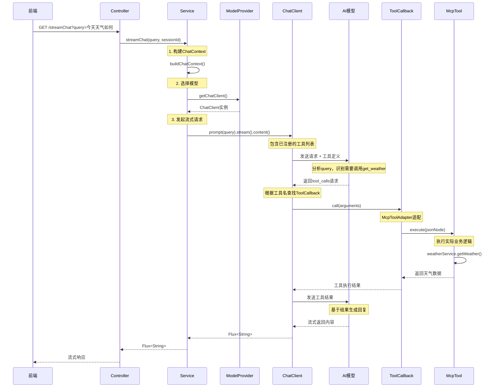
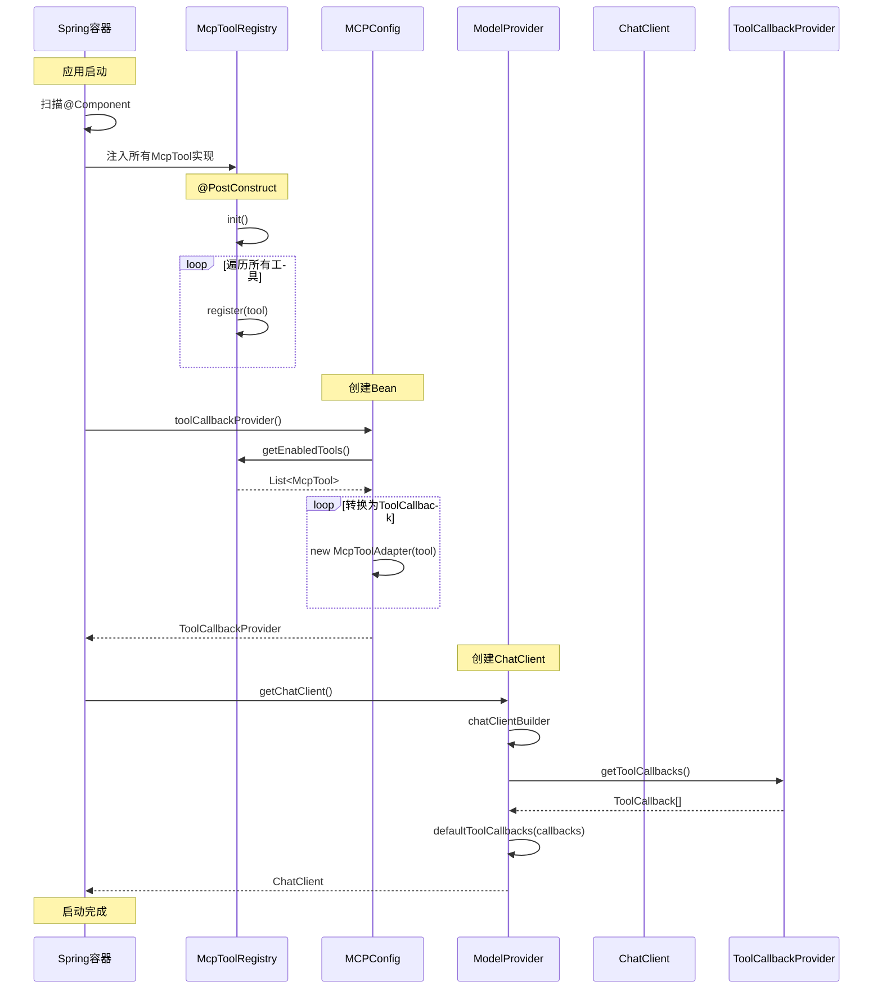
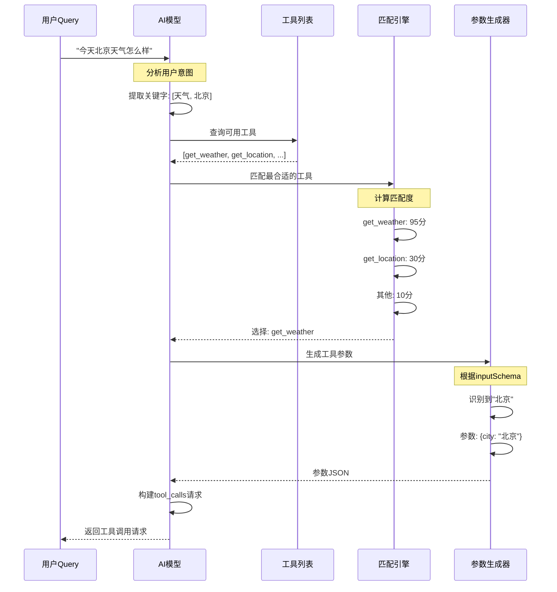
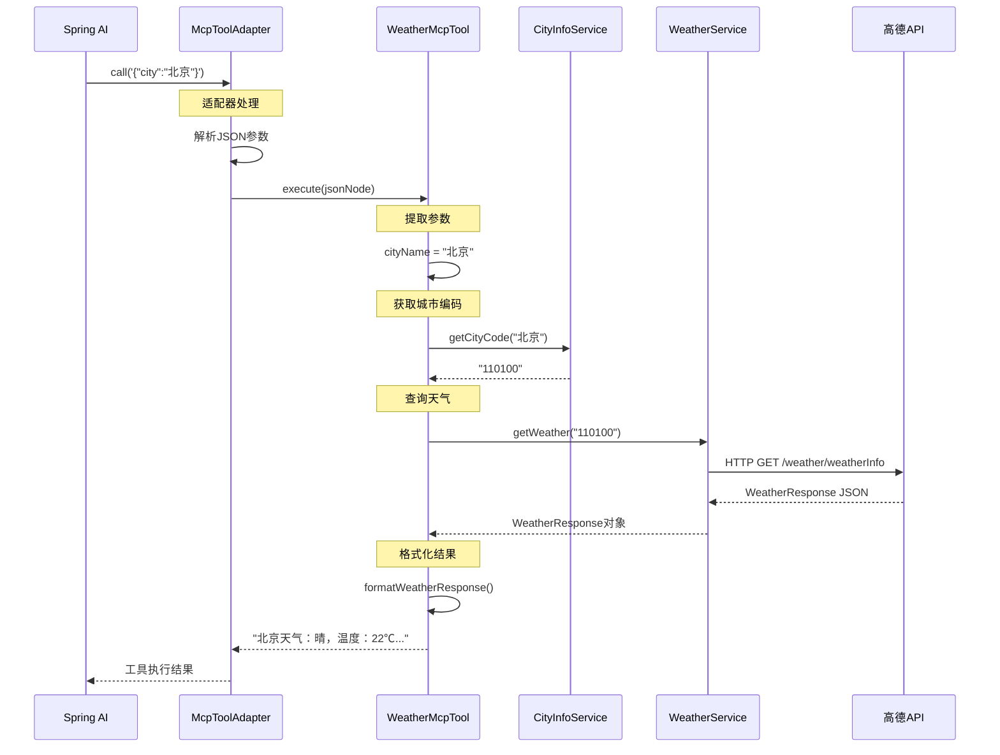
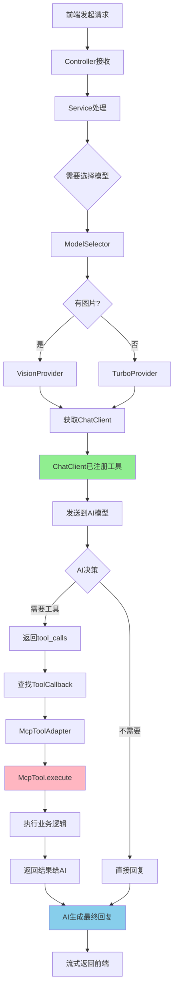
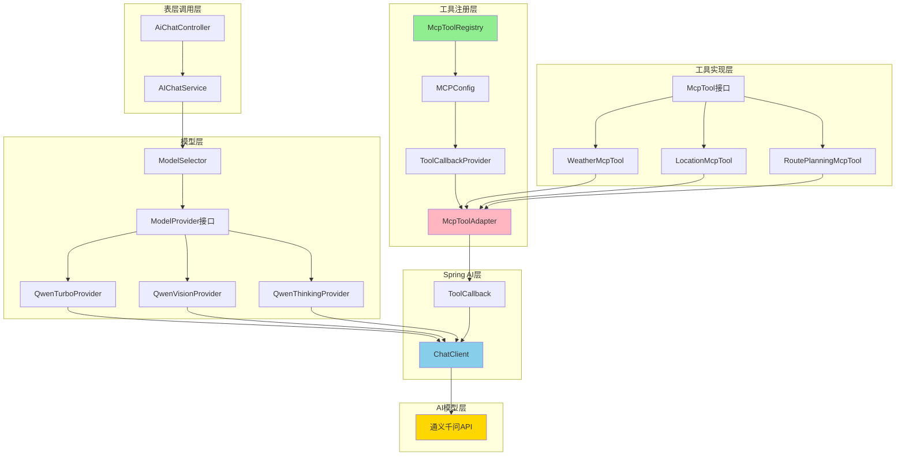
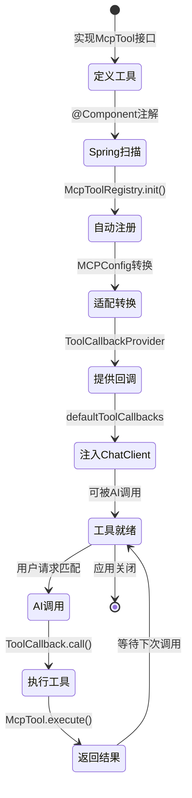
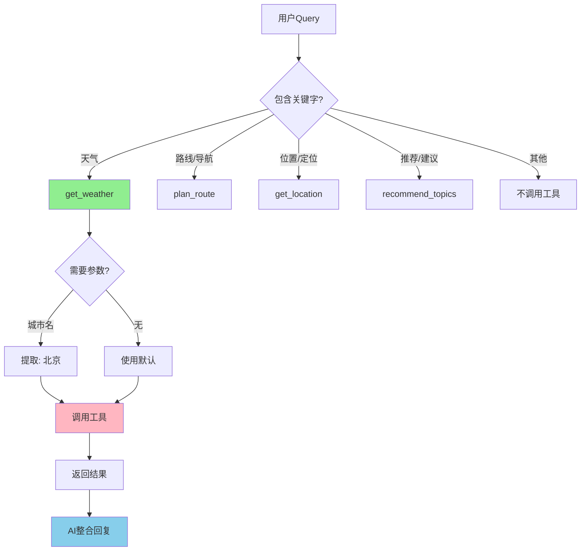
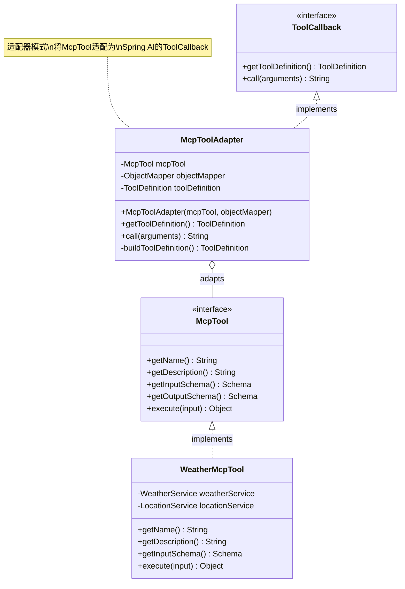
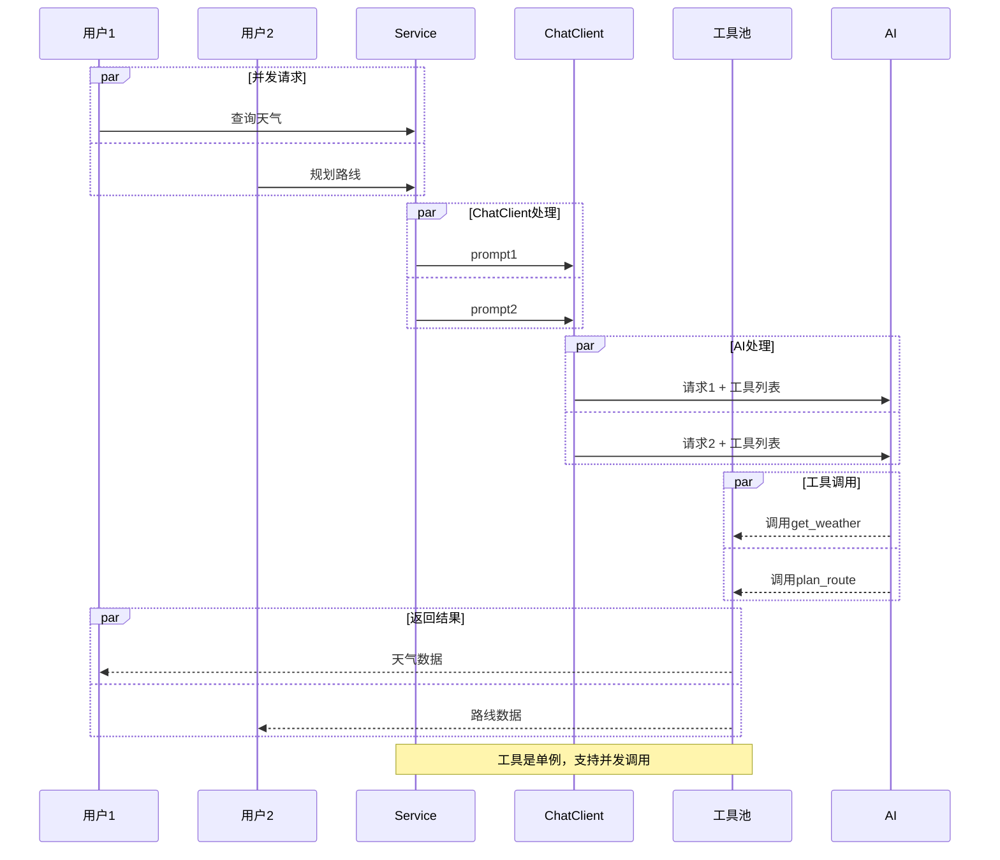

# MCP工具调用时序图

## 📊 完整时序图



---

## 🔧 启动时的注册流程



---

## 🎯 AI决策工具调用流程



---

## 🔄 工具执行详细流程



---

## 📱 前端到后端完整链路



---

## 🏗️ 系统架构层次图



---

## 🔐 工具注册与生命周期



---

## 🎭 工具匹配决策树



---

## 🧩 适配器模式详解



---

## 📈 性能与并发



---

## 🎯 关键时序点

### 1. 启动阶段（只执行一次）
```
Spring容器启动 
→ 扫描McpTool实现 (0.1s)
→ McpToolRegistry注册 (0.05s)
→ MCPConfig转换 (0.05s)
→ ChatClient创建 (0.5s)
→ 工具就绪 (总耗时: ~0.7s)
```

### 2. 请求阶段（每次请求）
```
接收请求 (0ms)
→ Service处理 (1ms)
→ 发送到AI (50ms)
→ AI分析决策 (200ms)
→ 工具调用 (500ms) ← 主要耗时
→ AI生成回复 (300ms)
→ 流式返回 (实时)
总耗时: ~1s
```

### 3. 工具执行阶段
```
接收参数 (1ms)
→ 参数解析 (2ms)
→ 业务逻辑 (400ms) ← 主要耗时（API调用）
→ 结果格式化 (5ms)
→ 返回结果 (1ms)
```

---

## 💡 优化建议

### 1. 工具描述优化
```java
// 让AI更容易理解
@Override
public String getDescription() {
    return "【天气查询】获取指定城市的实时天气。" +
           "支持：北京、上海等中国主要城市。" +
           "返回：温度、天气状况、风向风力等。";
}
```

### 2. Schema优化
```java
// 提供更多约束帮助AI生成正确参数
properties.put("city", Schema.builder()
    .type("string")
    .description("城市名称")
    .pattern("^[\u4e00-\u9fa5]{2,10}$")  // 中文2-10字
    .examples(List.of("北京", "上海", "深圳"))
    .build()
);
```

### 3. 并发优化
```java
// 工具内部使用异步处理
@Override
public Object execute(JsonNode input) {
    return CompletableFuture
        .supplyAsync(() -> weatherService.getWeather(city))
        .thenApply(this::formatResponse)
        .get(5, TimeUnit.SECONDS);  // 超时保护
}
```

---

这些时序图清晰展示了MCP工具系统的完整调用流程！
